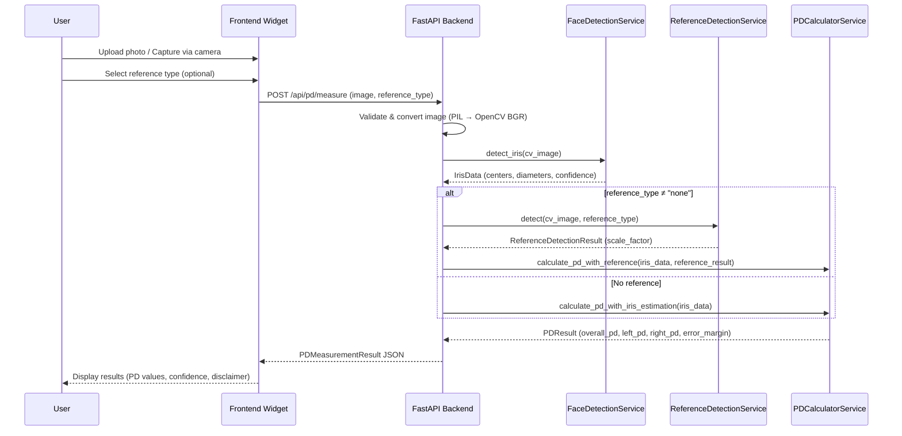
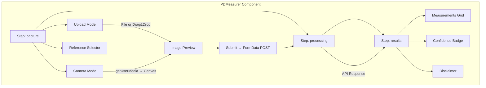

# PD Measurement System — Architecture & Details

> A complete **Pupil Distance (PD)** measurement solution for eyewear companies, built with a Python/FastAPI backend, a React/TypeScript embeddable frontend widget, and computer-vision-powered iris detection.

---

## Project Summary

### What Is This?

The **PD Measurement System** is a self-hosted, embeddable tool that enables eyewear companies to let their customers measure their **Pupil Distance (PD)** — the distance between the centers of the pupils — directly from a browser. Accurate PD is critical for fitting prescription lenses, and this system removes the need for an in-person visit by using **computer vision and machine learning** to estimate PD from a single photo or live camera capture.

### Who Is It For?

This tool is built for **eyewear e-commerce companies** (like Specscart) who want to offer an integrated PD measurement experience on their website — either as a standalone page or as a lightweight **embeddable widget** that can be dropped into any HTML page, React app, or Next.js project.

### How It Works (At a Glance)

1. **User captures a photo** — via file upload or live camera feed in the browser
2. **Optionally places a reference object** (credit card, UK coin, ruler) next to their face for improved accuracy
3. **Image is sent to the backend API** — which runs face and iris detection using MediaPipe
4. **PD is calculated** using either iris diameter estimation or reference object calibration
5. **Results are returned** — overall PD, left eye PD, right eye PD, confidence score, and error margin

### Tech Stack

| Layer                | Technology                     | Purpose                                                  |
| -------------------- | ------------------------------ | -------------------------------------------------------- |
| **Backend API**      | Python 3.10+, FastAPI, Uvicorn | REST API serving PD measurement endpoints                |
| **Computer Vision**  | MediaPipe Face Mesh, OpenCV    | Face/iris landmark detection, reference object detection |
| **ML Model**         | MediaPipe Face Mesh v0.10.9    | 478 facial landmarks including 10 iris points            |
| **Image Processing** | Pillow, NumPy                  | Image conversion, numerical computations                 |
| **Data Validation**  | Pydantic v2                    | Request/response schema validation                       |
| **Frontend**         | React 18, TypeScript 5, Vite 5 | Interactive widget UI with camera/upload support         |
| **Widget System**    | Shadow DOM, IIFE bundle        | Style-isolated embeddable widget for any website         |

### Key Capabilities

- 🎯 **Dual measurement methods** — iris estimation (no props needed) or reference-object calibration (±1.0mm accuracy)
- 📱 **Multiple input methods** — file upload (drag & drop) and live camera capture
- 📏 **10 reference objects** — credit cards, 8 UK coins, and rulers
- 🔌 **Embed anywhere** — single `<script>` tag, works in React, Next.js, or plain HTML
- 🛡️ **Shadow DOM isolation** — widget styles never clash with host page CSS
- ⚠️ **Transparent disclaimers** — every result includes confidence score, error margin, and a medical disclaimer
- 🐍 **Zero Node.js on backend** — pure Python backend with no JavaScript dependencies
- 📄 **Swagger docs** — auto-generated API documentation at `/docs`

### Important Numbers

| Metric                      | Value                    |
| --------------------------- | ------------------------ |
| Iris estimation accuracy    | ±1.5mm (91% of cases)    |
| Reference-assisted accuracy | ±1.0mm                   |
| Average human iris diameter | 11.7mm (σ = 0.5mm)       |
| Face mesh landmarks         | 478 (468 face + 10 iris) |
| API endpoints               | 4                        |
| Backend services            | 3                        |
| Supported reference objects | 10                       |
| Frontend component lines    | ~469                     |

---

## Table of Contents

- [High-Level Architecture](#high-level-architecture)
- [System Data Flow](#system-data-flow)
- [Backend — Python / FastAPI](#backend--python--fastapi)
    - [API Endpoints](#api-endpoints)
    - [Services Layer](#services-layer)
    - [Data Models](#data-models)
    - [Dependencies](#dependencies)
- [Frontend — React / TypeScript / Vite](#frontend--react--typescript--vite)
    - [Component Architecture](#component-architecture)
    - [Widget Embed System](#widget-embed-system)
    - [Build Configurations](#build-configurations)
    - [Dependencies](#frontend-dependencies)
- [Integration Examples](#integration-examples)
- [Measurement Algorithms](#measurement-algorithms)
    - [Method 1: Iris Estimation](#method-1-iris-estimation)
    - [Method 2: Reference Object Calibration](#method-2-reference-object-calibration)
- [Reference Object Detection](#reference-object-detection)
- [Confidence & Error Margins](#confidence--error-margins)
- [Project File Map](#project-file-map)
- [Future Enhancements (Phase 2)](#future-enhancements-phase-2)

---

## High-Level Architecture

```mermaid
graph LR
    subgraph Client
        A[Browser / App]
    end

    subgraph "Frontend Widget (React + Vite)"
        B["PDMeasurer Component"]
        C["Widget Embed (IIFE)"]
    end

    subgraph "Backend API (FastAPI)"
        D["POST /api/pd/measure"]
        E["FaceDetectionService"]
        F["ReferenceDetectionService"]
        G["PDCalculatorService"]
    end

    A -->|Image Upload / Camera Capture| B
    B -->|FormData (image + reference_type)| D
    D --> E
    D --> F
    E --> G
    F --> G
    G -->|PDMeasurementResult JSON| B
    B -->|onMeasurement callback| A
    C -.->|Shadow DOM embed| B
```

---

## System Data Flow



---

## Backend — Python / FastAPI

**Location:** `backend/`  
**Runtime:** Python 3.10+  
**Framework:** FastAPI v0.109.2 with Uvicorn

### API Endpoints

| Method | Path                   | Description                               | Auth |
| ------ | ---------------------- | ----------------------------------------- | ---- |
| `GET`  | `/`                    | Health check — returns status & version   | None |
| `GET`  | `/api/health`          | Health check endpoint                     | None |
| `POST` | `/api/pd/measure`      | **Core endpoint** — measure PD from image | None |
| `GET`  | `/api/reference-types` | List all supported reference object types | None |

#### `POST /api/pd/measure` — Request & Response

**Request** (multipart/form-data):
| Field | Type | Required | Description |
|------------------|----------|----------|---------------------------------------|
| `image` | File | ✅ | Face image (JPEG, PNG, WebP) |
| `reference_type` | string | ❌ | Reference object type (default: `none`) |

**Response** (`PDMeasurementResult`):

```json
{
    "overall_pd_mm": 63.5,
    "left_pd_mm": 31.8,
    "right_pd_mm": 31.7,
    "method": "iris_estimation",
    "model_used": "MediaPipe Face Mesh v0.10.9 with Iris Refinement",
    "confidence_score": 0.88,
    "error_margin": {
        "value_mm": 1.5,
        "percentage": 3.0,
        "confidence_score": 0.88
    },
    "disclaimer": "Measurement Method: Iris Diameter Estimation...",
    "face_detected": true,
    "eyes_detected": true,
    "reference_detected": null,
    "reference_scale_factor": null
}
```

### Services Layer

The backend follows a **service-oriented architecture** with three core services:

#### 1. `FaceDetectionService` — `services/face_detection.py`

- **Model:** MediaPipe Face Mesh with 478 landmarks (468 face + 10 iris)
- **Iris Landmarks:** Right eye center = `468`, Left eye center = `473`
- **Key Methods:**
    - `detect_iris(image)` → `IrisData` — detects iris centers, diameters, face width
    - `get_nose_bridge_position(image)` → `(x, y)` for monocular PD
    - `_calculate_iris_diameter(landmarks)` — average radius from 4 edge points × 2
    - `_calculate_confidence(left, right, diameters)` — composite score from visibility (30%), diameter consistency (40%), Z-depth consistency (30%)

**IrisData structure:**
| Field | Type | Description |
|--------------------------|------------------|---------------------------------|
| `left_iris_center` | `(x, y, z)` | Normalized coordinates |
| `right_iris_center` | `(x, y, z)` | Normalized coordinates |
| `left_iris_pixel` | `(x, y)` | Pixel coordinates |
| `right_iris_pixel` | `(x, y)` | Pixel coordinates |
| `left_iris_diameter_px` | `float` | Left iris diameter in pixels |
| `right_iris_diameter_px` | `float` | Right iris diameter in pixels |
| `face_width_px` | `float` | Face width (outer eye corners) |
| `confidence` | `float` (0–1) | Detection confidence score |

#### 2. `ReferenceDetectionService` — `services/reference_detection.py`

Detects reference objects using OpenCV for scale calibration:

| Object Type | Detection Method            | Key OpenCV Functions                                                         |
| ----------- | --------------------------- | ---------------------------------------------------------------------------- |
| Credit Card | Rectangle contour detection | `Canny` → `findContours` → `approxPolyDP` → aspect ratio check (1.586 ± 15%) |
| GBP Coins   | Circle detection            | `HoughCircles` (Hough Transform) with radius 20–200px                        |
| Ruler       | Line segment detection      | `HoughLinesP` → vertical line clustering → median spacing                    |

**Supported reference objects:**

| Type        | Real-world Dimension | Enum Value     |
| ----------- | -------------------- | -------------- |
| Credit Card | 85.6mm × 53.98mm     | `credit_card`  |
| 1 Penny     | ⌀ 20.3mm             | `coin_gbp_1p`  |
| 2 Pence     | ⌀ 25.9mm             | `coin_gbp_2p`  |
| 5 Pence     | ⌀ 18.0mm             | `coin_gbp_5p`  |
| 10 Pence    | ⌀ 24.5mm             | `coin_gbp_10p` |
| 20 Pence    | ⌀ 21.4mm (7-sided)   | `coin_gbp_20p` |
| 50 Pence    | ⌀ 27.3mm (7-sided)   | `coin_gbp_50p` |
| £1 Coin     | ⌀ 23.43mm            | `coin_gbp_1`   |
| £2 Coin     | ⌀ 28.4mm             | `coin_gbp_2`   |
| Ruler       | 10mm segments        | `ruler`        |

#### 3. `PDCalculatorService` — `services/pd_calculator.py`

Two calculation paths based on whether a reference object is detected:

- `calculate_pd_with_iris_estimation(iris_data)` — uses the medical constant **11.7mm average iris diameter**
- `calculate_pd_with_reference(iris_data, reference_result)` — uses detected reference object's `scale_factor` (mm/px)

Both methods compute:

1. **Overall PD:** Euclidean distance between iris centers × scale
2. **Monocular PD:** Distance from each iris center to the midpoint (nose bridge approximation) × scale

### Data Models

Defined in `models/schemas.py` using **Pydantic v2**:

| Model                  | Purpose                                      |
| ---------------------- | -------------------------------------------- |
| `ReferenceType`        | Enum of all supported reference object types |
| `MeasurementMethod`    | Enum: `iris_estimation`, `reference_object`  |
| `PDMeasurementRequest` | Request body model                           |
| `ErrorMargin`          | Error margin details (mm, %, confidence)     |
| `PDMeasurementResult`  | Full API response model                      |
| `HealthResponse`       | Health check response                        |
| `ErrorResponse`        | Error response model                         |

### Dependencies

| Package            | Version  | Purpose                                  |
| ------------------ | -------- | ---------------------------------------- |
| `fastapi`          | 0.109.2  | Web framework                            |
| `uvicorn`          | 0.27.1   | ASGI server                              |
| `python-multipart` | 0.0.9    | File upload handling                     |
| `pillow`           | 10.2.0   | Image loading & conversion               |
| `opencv-python`    | 4.9.0.80 | Computer vision (contours, HoughCircles) |
| `mediapipe`        | 0.10.14  | Face mesh + iris detection               |
| `numpy`            | 1.26.4   | Numerical computations                   |
| `pydantic`         | 2.6.1    | Data validation / serialization          |

---

## Frontend — React / TypeScript / Vite

**Location:** `frontend/`  
**Runtime:** Node.js 18+  
**Framework:** React 18 + Vite 5 + TypeScript 5

### Component Architecture



**State Machine:**

| Step         | UI Shown                                                                 |
| ------------ | ------------------------------------------------------------------------ |
| `capture`    | Upload/camera tabs, image preview, reference selector, submit button     |
| `processing` | Spinner with "Analyzing your photo..." text                              |
| `results`    | Measurement values, confidence, method info, disclaimer, "Measure Again" |

**Props (`PDMeasurerProps`):**

| Prop            | Type                                    | Default           | Description          |
| --------------- | --------------------------------------- | ----------------- | -------------------- |
| `apiEndpoint`   | `string`                                | `/api/pd/measure` | Backend API URL      |
| `onMeasurement` | `(result: PDMeasurementResult) => void` | —                 | Success callback     |
| `onError`       | `(error: string) => void`               | —                 | Error callback       |
| `className`     | `string`                                | `""`              | Custom CSS class     |
| `primaryColor`  | `string`                                | —                 | Theme color override |

### Widget Embed System

The widget can be distributed as a **single IIFE JavaScript file** (`pd-widget.js`) that embeds in any HTML page:

```
frontend/src/embed.tsx  →  Vite (IIFE build)  →  dist/widget/pd-widget.js
```

**Key design decisions:**

- **Shadow DOM isolation** — styles don't leak to/from the host page
- **React bundled** — no external React dependency required
- **Global API** — `window.PDMeasurementWidget` exposes `init()`, `destroy()`, `getInstances()`

**Widget API:**

```javascript
PDMeasurementWidget.init("#container", {
    apiEndpoint: "https://api.example.com/api/pd/measure",
    onMeasurement: (result) => {
        /* ... */
    },
    onError: (error) => {
        /* ... */
    },
    primaryColor: "#4f46e5",
});

PDMeasurementWidget.destroy("container-id");
PDMeasurementWidget.getInstances(); // ['container-id']
PDMeasurementWidget.version; // '1.0.0'
```

### Build Configurations

| Config                  | Entry Point     | Output                     | Format | Purpose                  |
| ----------------------- | --------------- | -------------------------- | ------ | ------------------------ |
| `vite.config.ts`        | `src/main.tsx`  | Dev server `:3000`         | ESM    | Development with HMR     |
| `vite.widget.config.ts` | `src/embed.tsx` | `dist/widget/pd-widget.js` | IIFE   | Production widget bundle |

**Dev server proxy:** `/api/*` → `http://localhost:8000` (backend)

### Frontend Dependencies

| Package      | Version | Purpose       |
| ------------ | ------- | ------------- |
| `react`      | ^18.2.0 | UI framework  |
| `react-dom`  | ^18.2.0 | DOM rendering |
| `vite`       | ^5.1.0  | Build tool    |
| `typescript` | ^5.3.3  | Type safety   |

---

## Integration Examples

**Location:** `examples/`

| Example      | File                                       | Description                                         |
| ------------ | ------------------------------------------ | --------------------------------------------------- |
| Vanilla HTML | `examples/vanilla-html/index.html`         | Full working demo using the widget IIFE build       |
| Next.js      | `examples/nextjs/pages/pd-measurement.tsx` | Next.js page template with component import pattern |

---

## Measurement Algorithms

### Method 1: Iris Estimation

Uses the **medical constant** that the average human iris diameter is **11.7mm** (σ = 0.5mm).

```
Scale (mm/px) = 11.7mm / avg_iris_diameter_px
Overall PD    = ‖left_iris_px − right_iris_px‖ × Scale
Left PD       = ‖left_iris_px − center_px‖ × Scale
Right PD      = ‖right_iris_px − center_px‖ × Scale
```

- **Center** is approximated as the midpoint between the two iris centers
- **Accuracy:** ±1.5mm in ~91% of cases

### Method 2: Reference Object Calibration

Uses a detected reference object with known real-world dimensions to compute `mm/px` scale:

```
Scale (mm/px) = known_dimension_mm / detected_dimension_px
```

Then applies the same PD formulas as Method 1 using this more accurate scale.

- **Accuracy:** ±1.0mm
- **Fallback:** If the reference object is not detected, the system falls back to iris estimation with an updated disclaimer

---

## Confidence & Error Margins

### Confidence Score Components

| Factor               | Weight | Calculation                                   |
| -------------------- | ------ | --------------------------------------------- | ---------------- | ------ |
| Landmark Visibility  | 30%    | Presence of iris landmarks                    |
| Diameter Consistency | 40%    | `min(left_d, right_d) / max(left_d, right_d)` |
| Z-Depth Consistency  | 30%    | `max(0, 1.0 −                                 | z_left − z_right | × 10)` |

### Error Margin Presets

| Method           | Base Error | Base Error % | Base Confidence |
| ---------------- | ---------- | ------------ | --------------- |
| Iris Estimation  | ±1.5mm     | ±3.0%        | 0.88            |
| Reference Object | ±1.0mm     | ±2.0%        | 0.92            |

Error margins are dynamically adjusted:

```
error_multiplier = 1.0 + (1.0 − detection_confidence) × 0.5   // Iris method
error_multiplier = 1.0 + (1.0 − min(face_conf, ref_conf)) × 0.3  // Reference method
```

---

## Project File Map

```
antigravity-pd-project/
├── README.md                              # Project overview & quick start
├── ARCHITECTURE.md                        # ← This file
│
├── backend/
│   ├── main.py                            # FastAPI app, CORS, 4 endpoints, service init
│   ├── requirements.txt                   # Python dependencies (8 packages)
│   ├── models/
│   │   ├── __init__.py
│   │   └── schemas.py                     # Pydantic v2 models (7 schemas)
│   └── services/
│       ├── __init__.py
│       ├── face_detection.py              # MediaPipe FaceMesh, IrisData dataclass
│       ├── reference_detection.py         # OpenCV contour/circle/line detection
│       └── pd_calculator.py               # PD math, PDResult dataclass, disclaimers
│
├── frontend/
│   ├── package.json                       # React 18, Vite 5, TypeScript 5
│   ├── tsconfig.json                      # TypeScript configuration
│   ├── vite.config.ts                     # Dev server (port 3000, API proxy → 8000)
│   ├── vite.widget.config.ts              # Widget IIFE build → dist/widget/pd-widget.js
│   ├── index.html                         # Dev entry HTML
│   ├── src/
│   │   ├── main.tsx                       # Dev entry point
│   │   ├── embed.tsx                      # Widget entry (Shadow DOM, global API)
│   │   ├── index.css                      # Dev page styles
│   │   ├── types/
│   │   │   └── index.ts                   # TypeScript interfaces & types
│   │   └── components/
│   │       └── PDMeasurer/
│   │           ├── index.tsx              # Main component (469 lines, 3-step flow)
│   │           └── styles.css             # Component styles (CSS variables)
│   └── dist/
│       └── widget/
│           └── pd-widget.js              # Built widget bundle (IIFE)
│
└── examples/
    ├── vanilla-html/
    │   └── index.html                     # Full demo with widget integration
    └── nextjs/
        └── pages/
            └── pd-measurement.tsx         # Next.js integration template
```

---

## Future Enhancements (Phase 2)

| Feature                      | Description                                         |
| ---------------------------- | --------------------------------------------------- |
| WebXR Depth Sensing          | AR-enabled measurement using depth cameras          |
| Multi-face Support           | Measure PD for multiple faces in one image          |
| Measurement History          | Store and recall past measurements                  |
| Real-time Video Tracking     | Continuous PD measurement via video stream          |
| Additional Reference Objects | EU coins, US coins, and other international objects |

---

_Last updated: February 16, 2026_
