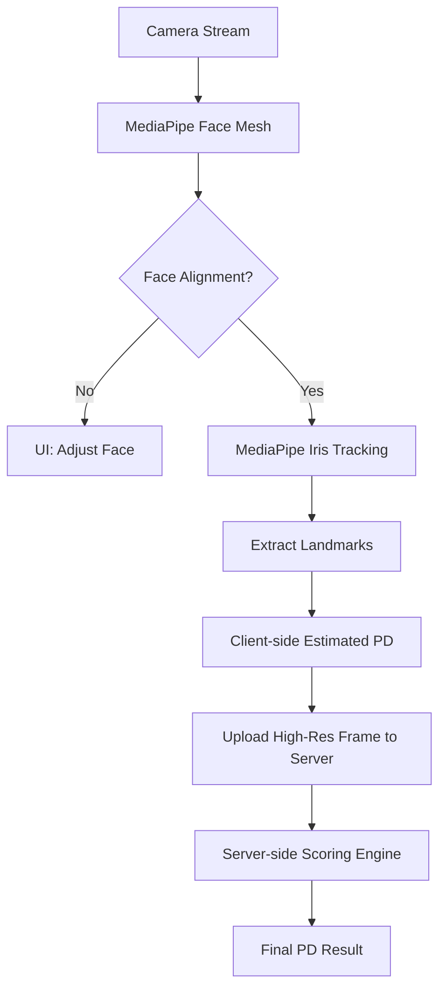

# Architecture Deep Dive: PD Measurement System

## Overview
The PD (Pupillary Distance) Measurement System is built on a hybrid client-server architecture. It leverages client-side computer vision (CV) for real-time feedback and server-side ML for high-precision validation and scoring.

## Hybrid Pipeline
The system utilizes a two-stage processing pipeline:
1. **Edge Processing (Client-side):**
   - Framework: MediaPipe Face Mesh + Iris Tracking.
   - Purpose: Real-time user guidance, face alignment, and preliminary landmark detection.
   - Technology: WebGL-accelerated WASM/JS for browser; CoreML/TFLite for mobile.
2. **Precision Scoring (Server-side):**
   - Framework: Python (FastAPI/PyTorch).
   - Purpose: High-resolution image analysis, sub-pixel landmark refinement, and final PD calculation using iris-to-pixel scaling.

## MediaPipe Pipeline Integration

## Iris-Based Scaling (Card-less)
Instead of requiring a physical reference like a credit card, the system uses the Human Visible Iris Diameter (HVID) as a reference.
- **Reference Constant:** Average HVID = 11.7mm.
- **Scaling Factor:** `S = 11.7 / Iris_Diameter_Pixels`.
- **PD Calculation:** `PD_mm = Interpupillary_Distance_Pixels * S`.

## Data Flow & State Management
- **Real-time State:** Managed via React/Redux or similar.
- **Processing State:** Managed via a state machine (Idle -> Detecting -> Capture -> Processing -> Result).
