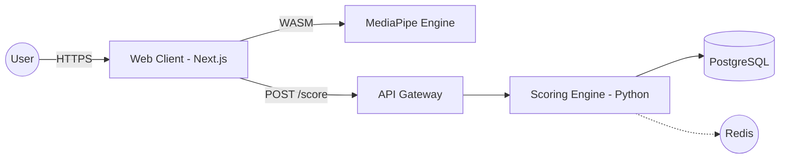

# 04. System Architecture

## Component Overview
- **Web Client:** Next.js application hosting the MediaPipe WASM runtime.
- **API Gateway:** Traefik or Nginx handling SSL termination and rate limiting.
- **Scoring Engine:** A Python-based microservice using OpenCV and PyTorch for sub-pixel landmark refinement.
- **Result Cache:** Redis for temporary storage of session results.

## Infrastructure Diagram (Conceptual)

